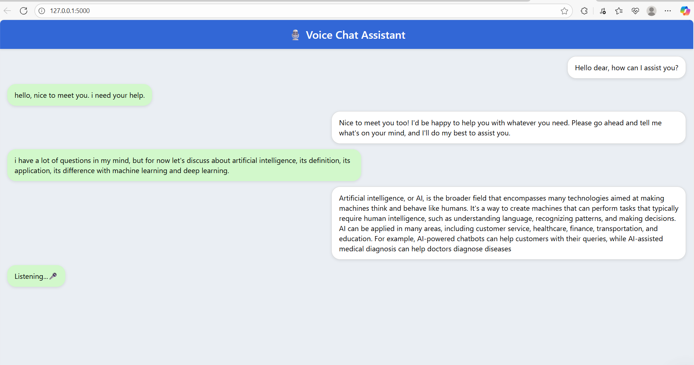
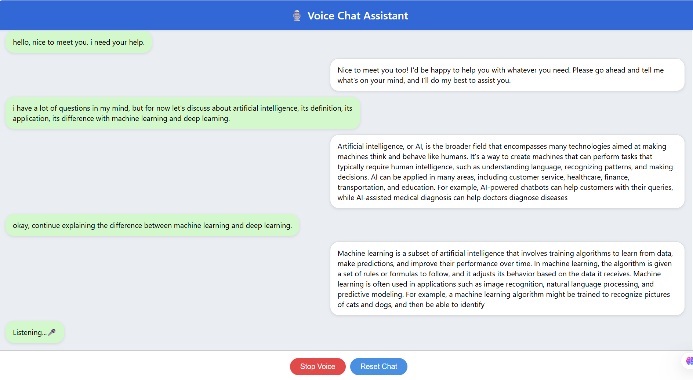
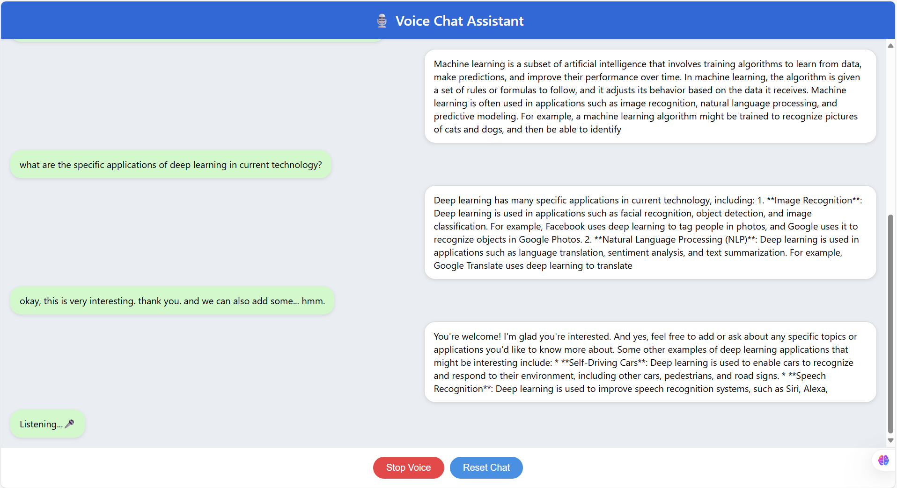
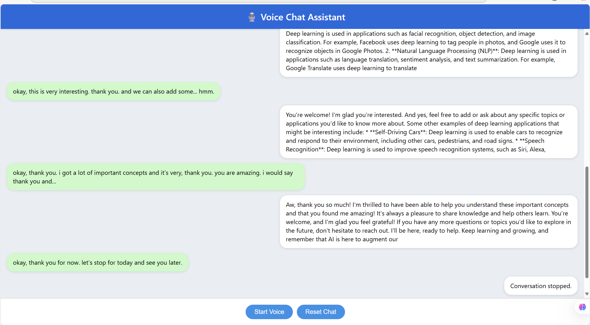

# Voice-Chat-Assistant-AI-agent
# 🎙️ Voice Chat Assistant

A browser-based conversational voice assistant built with Python and Flask that enables natural spoken interaction using STT, LLM, and TTS components. Developed as part of my Master’s in Artificial Intelligence and Computer Science.

---

## 🚀 Features

- 🔁 Looped conversation until user stops
- 🗣️ Real-time Speech-to-Text (STT) using Whisper
- 🤖 LLM-generated replies with Groq API (LLaMA3-8B)
- 🔊 Offline Text-to-Speech (TTS) using pyttsx3
- 🌐 Clean browser interface with live interaction and audio playback
- 🔄 Reset and stop chat functionality
- 🎧 Greeting message at start

---

## 🧠 Tech Stack

| Component      | Library/Tool            |
|----------------|--------------------------|
| Backend        | Python, Flask            |
| STT            | OpenAI Whisper           |
| LLM            | Groq API (LLaMA3-8B)     |
| TTS            | pyttsx3 (offline TTS)    |
| UI             | HTML, CSS, JavaScript    |
| Audio Handling | sounddevice, scipy       |

---

## 📁 Project Structure

```
voice-chat-assistant-ai-agent/
├── app.py                     # Main Flask backend: STT, LLM, TTS, and routing
├── templates/
│   └── index.html             # Frontend UI (HTML, CSS, JS) for the voice chat interface
├── static/
│   └── audio/                 # Directory for generated TTS audio files
├── assets/                    # Screenshots and UI assets
│   ├── screenshot-chat-1.png
│   ├── screenshot-chat-2.png
│   ├── screenshot-chat-3.png
│   └── screenshot-chat-4.png
├── .env                       # Environment file containing GROQ_API_KEY
├── requirements.txt           # Python dependencies
└── README.md                  # Project overview and usage guide


```

---

## ⚙️ Setup Instructions

### 1. Clone this repo

```bash
git clone https://github.com/yaekobB/Voice-Chat-Assistant-AI-agent.git
cd Voice-Chat-Assistant-AI-agent
```

### 2. Install dependencies

```bash
pip install -r requirements.txt
```

### 3. Add environment variables

Create a `.env` file in the root directory with:

```
GROQ_API_KEY=your_groq_api_key_here
```

### 4. Run the application

```bash
python app.py
```

Visit [http://localhost:5000](http://localhost:5000) in your browser.

---

## 🧪 Demo Workflow

1. Press **Start Voice**.
2. Assistant greets you and starts listening.
3. Speak your query (e.g., “What’s the weather like?”).
4. Assistant replies with text and voice.
5. Loop continues until you say: _stop_, _exit_, or press **Stop Voice**.

---
## 📸 Screenshots

Here are a few sample interactions from the voice assistant:

### ✅ Greeting and Listening


### ✅ Transcription and Response


### ✅ Ongoing Conversation


### ✅ Conversation End


---

## 🚀 Future Improvements

- [ ] Real-time VAD (voice activity detection)
- [ ] Voice interrupt using Web Audio API
- [ ] Replace pyttsx3 with more natural TTS (e.g., ElevenLabs, Google, Azure)
- [ ] Live transcription and streaming using WebSocket

---

## 📄 License

This project is licensed under the MIT License. Free to use, share, and modify with attribution.

---

